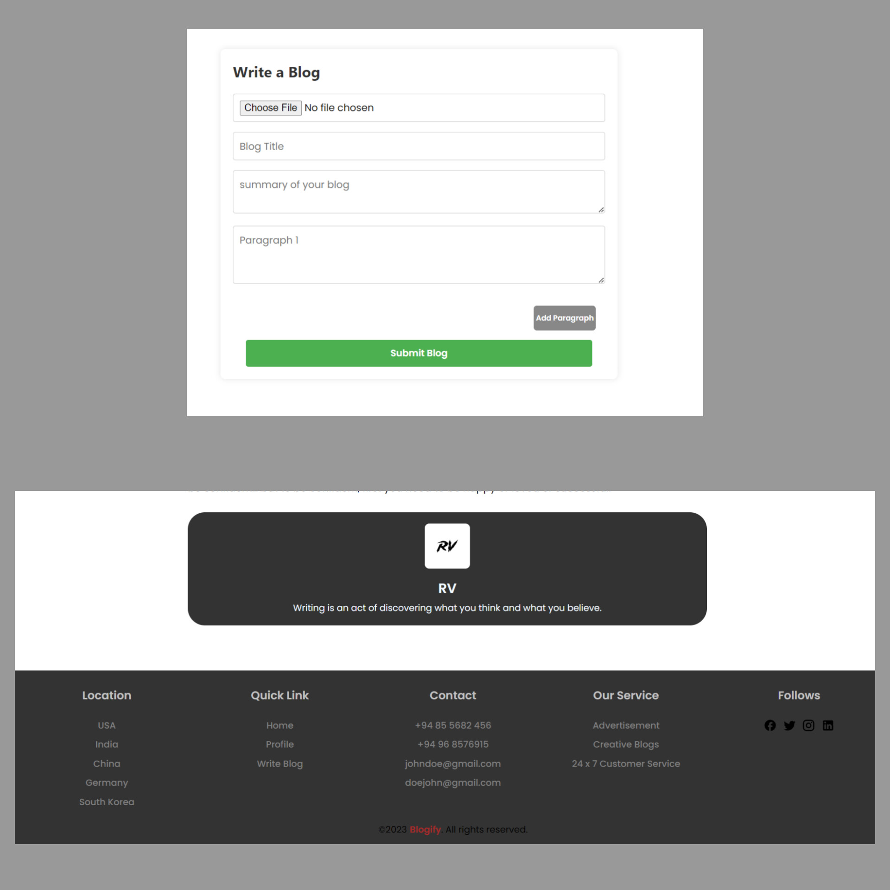

# Blogify

## Description

Full Stack Blog Web App built with MERN STACK

## Demo

[https://blogify-oki7.onrender.com](https://blogify-oki7.onrender.com)

## ScreenShots

### Authentication (signup / login)


### Write Blog / Footer



### Profile / Home / Blog Page


## Tech Stack

**Client:** React JS

**Server:** Node JS, Express JS

**Database:** Mongo DB

**Image Uploading:** Cloudinary

## Features

- **Authentication**

- **Profile**

- **View Other User Profile**

- **Write Blog**

- **Read Blog**

- **Delete Blog**

## Installation

To run this project locally, follow these steps:

1. Clone the repository:

```bash
  git clone https://github.com/Yuvrajshankar/Blogify.git
```

2. Go to the project directory

```bash
  cd Blogify
```

3. Install dependencies

```bash
  npm install
```

```bash
  cd frontend/
  npm install
```

5. add **".env"** in root folder

```bash
PORT = 4890
MONGO_URL = "Mongo Url"
JWT_SECRET = "Secret"
NODE_ENV = development
```

4. Start the server

```bash
  npm run server
```

5. Start the Client

```bash
  cd frontend
  npm start
```

## Made By

- [@Yuvrajshankar](https://github.com/Yuvrajshankar)

## License

This project is licensed under the [MIT License](LICENSE).
